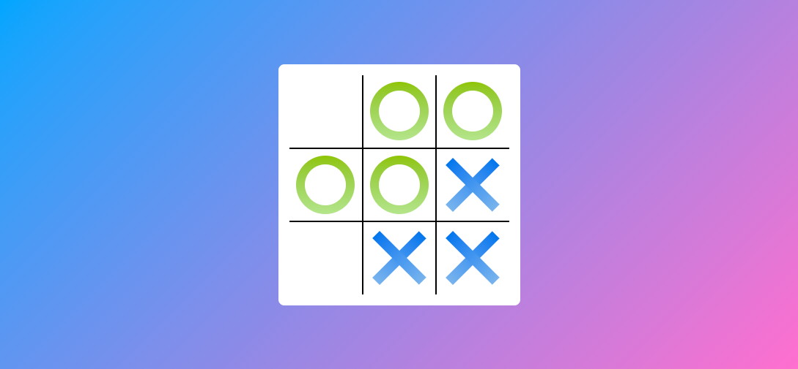
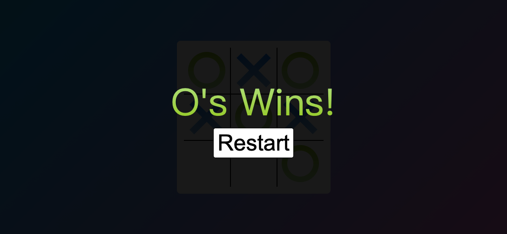
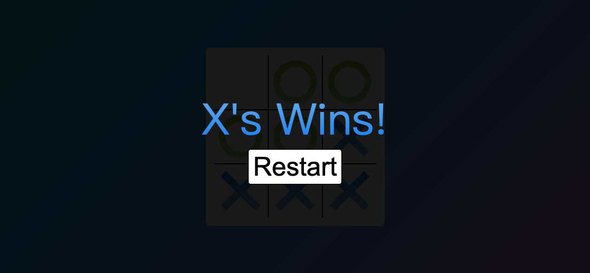
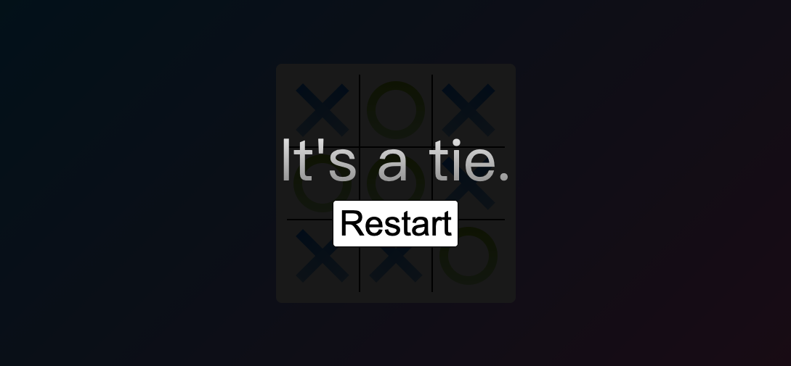

# JavaScript Project_Tic Tac Toe

This is a project originally from <a href="https://github.com/WebDevSimplified/JavaScript-Tic-Tac-Toe">WebDevSimplified</a>. I rewrote the JavaScript part on my own after I learnt how to do it. Also, I made it prettier by adding a constantly changing colourful background and giving the noughts and crosses some gradient colours.

Live site: https://jasontwuk.github.io/JavaScript-Project_Tic-Tac-Toe/

Playing this tic-tac-toe (noughts and crosses) game is easy, just click on the white board to place your mark.

If O wins, the following message will be shown. Press the restart button to play it again. Beause O wins, X will place mark first in the next round.

If X wins, the following message will be shown. Press the restart button to play it again. Beause X wins, O will place mark first in the next round.

If it is a tie, the following message will be shown. Press the restart button to play it again. The same person will carry on to place mark first in the next round.

